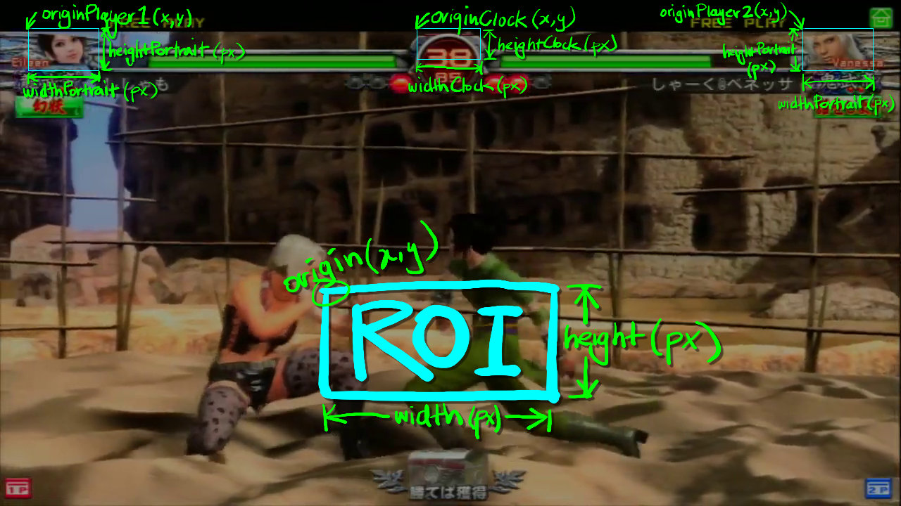

# Description
**Match Indexer** is a Python script that is run from the command-line to generate a match index for your Fighting Game videos. The match index includes:
* Timestamps for all matches
* Characters used
* Duration of each match
* Summary of character totals

Want an easy way to create timestamps for your YouTube videos? Just copy/paste the Match Indexer output into your video's description field, and away you go!

# Prerequisites
In order to use **Match Indexer** you need to install a Python interpreter and a couple of libraries:
1. Download and install Python (https://python.org/downloads)
2. Install NumPy:
   * `pip install numpy`
3. Install OpenCV (ref: https://pypi.org/project/opencv-python/)
   * `pip install opencv-python`

# Installation
Download the `match-indexer.py` file and ensure there are subfolders named `templates` and `layouts` at the same level. In this repository, these folders come preloaded to detect Virtua Fighter 5 Final Showdown matches.

# Setup
Before you can start using the **Match Indexer** you need to setup a couple of things. Firstly, you'll need to decide what video resolution you'll want to *work* with, as this will determine how you go about creating your templates and defining your layouts. 

The *Match Indexer* will process every single frame of your video, and within each frame it will search for *all the characters* in your Fighting Game's roster, on both Player 1 and 2 side, in order to detect a match. As you might imagine, the higher the resolution of the video being processed, the more pixels that need to be compared, and the more resource intesive (i.e. time consuming) this task becomes.

If you're a content creator / producer of the original video footage, consider creating a down-sampled video export for the purposes of running it through the **Match Indexer**. This will be much quicker to process than, say, 3 hours worth of tournament footage captured at 4K 60FPS. 

Once the processing is done, you can use the timestamps output in the description with your original, higher-resolution video that you upload to YouTube, or similar video-hosting platform. In my personal experience, I worked with videos using a resolution of 1280 x 720.

## Templates
Having decided on the working resolution for your **Match Indexer**, it's time to create *templates* for each character. In most Fighting Games, the selected character's portrait is typically displayed at the far ends of the health bar, so this will be the area **Match Indexer** searches in order to match it against a template.

For each character, you need to create two "templates" (image files) within the `templates` folder, one for Player 1 side and the other for Player 2. Do this by creating a `.jpg` file with the following naming convention:

    {character name}-1p.jpg
    {character name}-2p.jpg

The `{character name}` label will be used in the match indexer's output.

> [!NOTE]
> * This was deliberately designed this way, as opposed to using a single image and flipping it, since some games have non-mirrored 1P vs 2P character portraits.
> * Create a separate folder for each unique Fighting Game you wish to process. The folder name `templates` is the default, but you are free to create others for each of your games which you can then specify with the `-t DIR` command-line option.

## Layouts
Layout files (`{layout name}.py`) are placed in the `layouts` folder, and contain a single variable called `layout` which is a [Python Dictionary](https://docs.python.org/3/tutorial/datastructures.html#dictionaries) data type. This variable stores data in `key:value` pairs, and is used as your main configuration file.

The layout file must define the following keys:

| Key | Value | Description |
| --- | ---: | --- |
| scale | 1.0 | Scale for template images normalised to fullscreen (1.0). Refer to the [Scale](#Scale) section to understand how this is applied. |
| originPlayer1 | (x,y) | Pixel coorindates for the upper-left corner of Player 1's ROI |
| originPlayer2 | (x,y) | Pixel coorindates for the upper-left corner of Player 2's ROI |
| widthPortrait | px | The width, in pixels, of the Player Portrait's ROI |
| heightPortrait | px | The height, in pixels, of the Player Portrait's ROI |
| widthClock | px | The width, in pixels, of the Clock ROI |
| heightClock | px | The height, in pixels, of the Clock ROI |

This data is used to setup various **Regions of Interest (ROIs)** in which the templates will be compared for a match. Since we know exactly where the character portraits will appear, we can narrow down our search area, rather than try to search across the entire video frame, to optimise performance.

## Scale

# Usage
From a terminal window:

    > python.exe match-indexer.py OPTIONS LAYOUT FILENAME

* OPTIONS: See the [Options](#Options) section for details.
* LAYOUT: the name of the **layout** (`{layout}.py`) to use for indexing. See the [Layouts](#Layouts) section for more details.
* FILENAME: the filename of the video to process. See the [Filename](#Filename) section for more information on video formats.

# Options

    -h, --help  show this help message and exit
    -c          Output CSV format
    -n          Show match number sequentially in output
    -p          Preview while indexing
    -t DIR      Path to templates folder (default: "templates" in current folder)
    -z          Zoom preview window down to 50% (used with the -p option)
# Output
Print to screen, redirect to file, csv to spreadsheet

# FAQ

### Question
Answer 