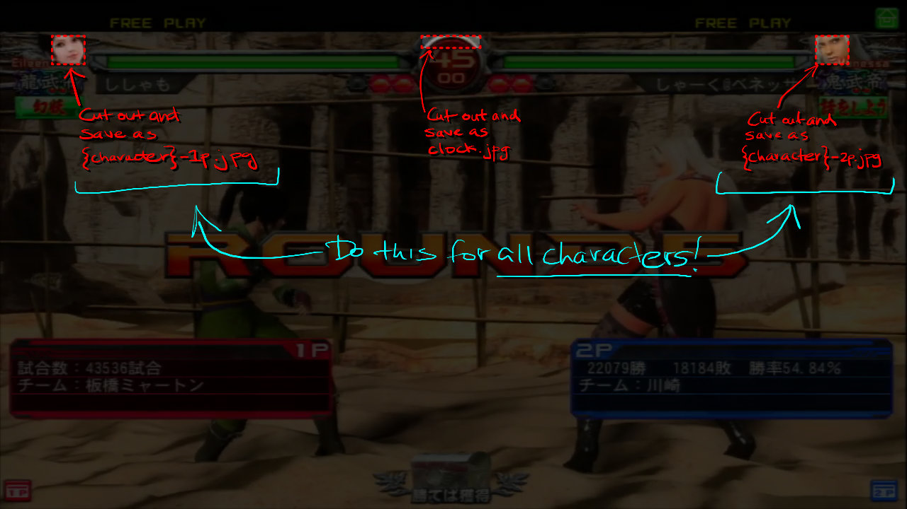
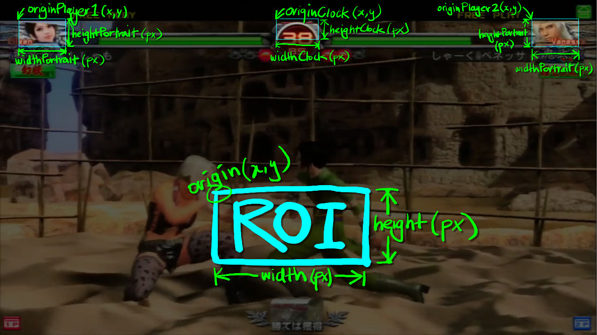
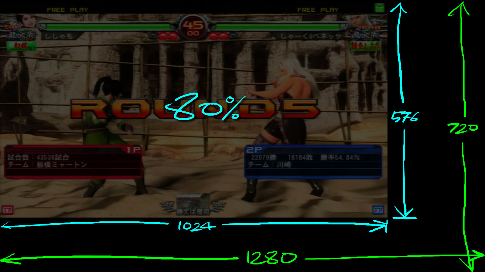

# Description
**Match Indexer** is a Python script that is run from the command-line to generate a match index for your Fighting Game videos. The match index includes:
* Timestamps for all matches
* Characters used
* Duration of each match
* Summary of character totals

Want an easy way to create timestamps for your YouTube videos? Just copy/paste the Match Indexer output into your video's description field, and away you go!

# Prerequisites
In order to use **Match Indexer** you need to install a Python interpreter and a couple of libraries:
1. Download and install Python (https://python.org/downloads)
2. Install NumPy:
   * `pip install numpy`
3. Install OpenCV (https://pypi.org/project/opencv-python/)
   * `pip install opencv-python`

# Installation
Download the `match-indexer.py` file and ensure there are subfolders named `templates` and `layouts` at the same level. In this repository, these folders come preloaded to detect Virtua Fighter 5 Final Showdown matches.

# Setup
Before you can start using the **Match Indexer** you need to setup a couple of things. Firstly, you'll need to decide what video resolution you'll want to *work* with, as this will determine how you go about creating your templates and defining your layouts. 

The *Match Indexer* will process every single frame of your video, and within each frame it will search for *all the characters* in your Fighting Game's roster, on both Player 1 and 2 side, in order to detect a match. As you might imagine, the higher the resolution of the video being processed, the more pixels that need to be compared, and the more resource intesive (i.e. time consuming) this task becomes.

If you're a content creator / producer of the original video footage, consider creating a down-sampled video export for the purposes of running it through the **Match Indexer**. This will be much quicker to process than, say, 3 hours worth of tournament footage captured at 4K 60FPS. 

Once the processing is done, you can use the timestamps output in the description with your original, higher-resolution video that you upload to YouTube, or similar video-hosting platform. In my personal experience, I worked with videos using a resolution of 1280 x 720.

## Templates
Having decided on the *working resolution* for your **Match Indexer**, it's time to create *templates* for each character. In most Fighting Games, the selected character's portrait is typically displayed at the far ends of the health bar, so this will be the area **Match Indexer** searches in order to match it against a template.

For each character, you need to create two image files within the `templates` folder, one for Player 1 side and the other for Player 2. Do this by creating a `.jpg` file with the following naming convention:

    {character}-1p.jpg
    {character}-2p.jpg

The `{character}` label will be used in the output as the character's name. Also, spaces are allowed in the `{character}` name.

> [!NOTE]
> * This was deliberately designed this way, as opposed to using a single image and flipping it, since some games have non-mirrored 1P vs 2P character portraits.

### How to create templates
My recommendation is to capture screenshots from the game at your *working resolution* with same player vs player matches, then use an image editing program to cut out the character portraits such that there's enough detail for them to be uniquely identifiable.

You'll also need to create a template for the clock.

> [!TIP]
> * Ensure that you capture no transparent sections around the character portrait, otherwise these will be virtually impossible to match with the ever-changing background that's visible behind the portrait.
> * Similarly, for the clock template, in addition to transparent surroundings, ensure that you don't include any digits that will (obviously) be constantly changing.
> * If you intend on processing multiple Fighting Games, then create a separate templates folder for each one, and name them appropriately. While `templates` folder is the default, you are free to specify which templates folder to use with the `-t DIR` command-line option.

## Layouts
Layout files (`{layout name}.py`) are placed in the `layouts` folder, and contain a single variable called `layout` which is a [Python Dictionary](https://docs.python.org/3/tutorial/datastructures.html#dictionaries) data type. This variable stores data in `key:value` pairs, and is used as the main configuration file.

The layout file must define the following keys:

| Key | Value | Description |
| --- | ---: | --- |
| scale | 1.0 | Scale for template images normalised to fullscreen (1.0). Refer to the [Scale](#Scale) section to understand how this is applied. |
| originPlayer1 | (x,y) | Pixel coorindates for the upper-left corner of Player 1's ROI |
| originPlayer2 | (x,y) | Pixel coorindates for the upper-left corner of Player 2's ROI |
| widthPortrait | px | The width, in pixels, of the Player Portrait's ROI |
| heightPortrait | px | The height, in pixels, of the Player Portrait's ROI |
| widthClock | px | The width, in pixels, of the Clock ROI |
| heightClock | px | The height, in pixels, of the Clock ROI |

This data is used to setup various **Regions of Interest (ROIs)** in which the templates will be compared for a match. Each ROI is simply determined by it's origin, width and height. Since we know exactly where the character portraits will appear, we can narrow down our search area, rather than try to search across the entire video frame, by defining fairly contained ROIs to optimise performance.

### Scale
While you may have decided on a particular *working resolution* for your videos and templates, sometimes the game you're trying to index isn't running at 'fullscreen'! This is often the case if the video footage includes some kind of stream or tournament overlay.

This is where adjusting the `scale` factor in the layout file comes in. This value is normalised to your *working resolution*. For example, let's say we are operating at 1280x720. A `scale` value of 1.0 (100%) indicates that the game footage is running at fullscreen, i.e. 1280x720. If, however, there's an overlay such that the game footage is not at fullscreen, then we need to measure that and determine the appropriate scale factor. 

Continuing our example, let's say I take a screenshot and measure out the game area using an image editing program and find that the game is occupying only 1024x576 pixels. A quick calculation reveals that 1024 / 1280 = 0.8 (or 80%). As such, in my layout for this footage I would set the `scale` factor to 0.8. Then, all the character and clock image templates will get scaled appropriately during processing and, hopefully, match correctly!

> [!IMPORTANT]
> The `scale` only applies to the template images, and not the ROIs. So, you'll need to determine their origins, widths and heights again for the custom/reduced layout.

# Usage
From a terminal window:

    > python.exe match-indexer.py OPTIONS LAYOUT FILENAME

* OPTIONS: See the [Options](#Options) section for details.
* LAYOUT: the name of the **layout** (`{layout}.py`) to use for indexing. See the [Layouts](#Layouts) section for more details.
* FILENAME: the filename of the video to process. 

# Options

    -h, --help  show this help message and exit
    -c          Output CSV format
    -n          Show match number sequentially in output
    -p          Preview while indexing
    -t DIR      Path to templates folder (default: "templates" in current folder)
    -z          Zoom preview window down to 50% (used with the -p option)

# Output
The default output will print the results to the terminal window screen. However, for particularly long videos and/or convenience, you may redirect the output to a file as follows:

    > python.exe match-indexer.py OPTIONS LAYOUT FILENAME > output.txt

Furthermore, outputting to CSV format (with the `-c` command-line option) makes it easy to paste into a spreadsheet for additional processing or analysis.
